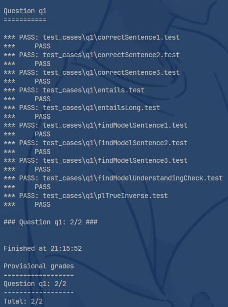
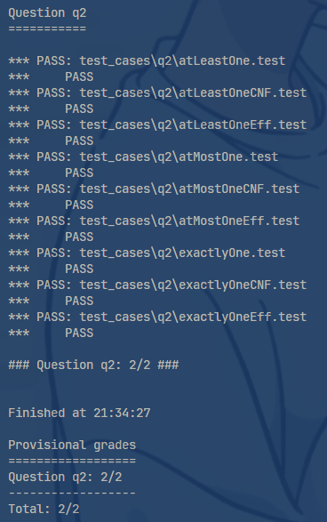
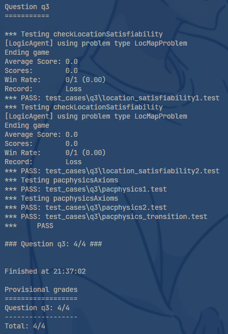
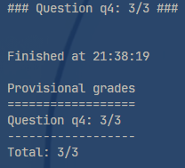
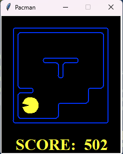
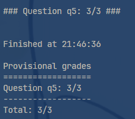
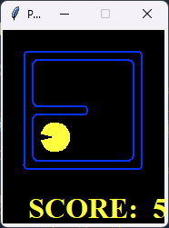

# 项目2--逻辑与经典规划  

***项目人员(单人完成):李玄同 231880224 [2321599317@qq.com](2321599317@qq.com)*** 

## 摘要

本项目基于吃豆人游戏,运用基础的逻辑表达式,实现了吃豆人行为的相关逻辑.

### 项目任务

编写代码使得吃豆人能够满足基础的基于逻辑知识库的寻路,捕食.

## 任务一:实现基础的逻辑表达式

1. **实现思路:** 

    - `sentence1 ->sentence3` 根据题目给出的式子,用题目要求的形式表达. **实现关键在于合理利用`conjoin`函数,将多个式子合取.
    - `findModel` 将句子转化为cnf式子,再利用定义的`pycoSAT`函数求解一个符合条件的真值模型即可.
    - `findModelUnderstandingCheck` 实际操作的过程中发现了两种写法均能成功.一种是定义一个新类,合理利用python类中的`__repr__`函数,直接返回变量名;一种是调用`Expr`类的op函数直接转换.
    - `entails` 返回一个蕴含式的真值,理解蕴含式在什么条件下不成立即可.
    - `plTrueInverse` 实现给定变量赋值,判断表达式的真值.运用`pl_true`函数即可

2. **代码总览**

   以下是 ***Problem 1*** 的代码实现：

   ```python
   def sentence1() -> Expr:
    A=Expr('A')
    B=Expr('B')
    C=Expr('C')
    expression1=A|B
    expression2=(~A)%(~B|C)
    expression3=disjoin(~A,~B,C)
    return conjoin(expression1,expression2,expression3)

    def sentence2() -> Expr:
    A=Expr('A')
    B=Expr('B')
    C=Expr('C')
    D=Expr('D')
    exp1=C%(B|D)
    exp2=A>>(~B&~D)
    exp3=~(B&~C)>>A
    exp4=~D>>C
    return conjoin(exp1,exp2,exp3,exp4)

    def sentence3() -> Expr:
    A=PropSymbolExpr('PacmanAlive_0')
    B=PropSymbolExpr('PacmanAlive_1')
    C=PropSymbolExpr('PacmanBorn_0')
    D=PropSymbolExpr('PacmanKilled_0')
    alive1=B%((A&(~D))|(~A&C))
    time0=~(A&C)
    born0=C
    return conjoin(alive1,time0,born0)

    def findModel(sentence: Expr) -> Dict[Expr, bool]:
    cnf_sentence = to_cnf(sentence)
    return pycoSAT(cnf_sentence)

    def findModelUnderstandingCheck() -> Dict[Expr, bool]:
    a = Expr('A')
    class ATo_a:
         def __init__(self, var_name: str):
             self.var_name = var_name

         def __repr__(self):
            return self.var_name

    return {ATo_a("a"): True}
    #a.op='a'
    #return {a:True}#方法二

    def entails(premise: Expr, conclusion: Expr) -> bool:
    a=premise & ~conclusion
    findModel(premise)
    return not findModel(a)

    def plTrueInverse(assignments: Dict[Expr, bool], inverse_statement: Expr) -> bool:
    return  pl_true(~inverse_statement,assignments)

3. **实验结果:**

    运行`python autograder.py -q q1`后的结果图:
    

## 任务二:实现逻辑函数

1. **实现思路:**

    - `atLeastOne` 要求至少有一个式子是真的,整个式子才是真的,可以联想到使用"或"--`disjoin`函数.在函数中使用列表推导式即可.
    - `atMostOne` 要求最多有一个式子是真的,整个式子才是真的,可以先将列表中的所有元素取反,接着再使用`itertools.combinations`和`disjoin`两两析取,这样如果原来有两个及以上的元素是`true`,他们分别取反再析取后的式子就是`false`.最后,对所有两两配对的析取式使用`conjoin`即可
    - `exactlyOne` 只能有一个式子是真的,那么调用上述两个函数后合取即可.

2. **代码总览**

   以下是 ***Problem 2*** 的代码实现：

   ```python
    def atLeastOne(literals: List[Expr]) -> Expr:
        return disjoin([i for i in literals])

    def atMostOne(literals: List[Expr]) -> Expr:
        lis=[~i for i in literals]
        comb=itertools.combinations(lis,2)
        re=[disjoin(list(i)) for i in comb]
        return conjoin([i for i in re])

    def exactlyOne(literals: List[Expr]) -> Expr:
        return atLeastOne(literals) & atMostOne(literals)

3. **实验结果:**

    运行`python autograder.py -q q2`后的结果图:
    

## 任务三:构建吃豆人世界

任务目标:实现对于吃豆人位置的逻辑描述

1. **实现思路:**

    - `pacmanSuccessorAxiomSingle` 利用`PropSymbolExpr`返回一个描述当前位置和时间,吃豆人所在的位置.根据题目要求返回`(当前位置)<=>可能的行动`这样一个表达式.可能的行动利用disjoin析取即可
    - `pacphysicsAxioms` 往吃豆人世界中添加公理.对于所有合理的位置(没有墙壁),要求有且只有一个吃豆人存在,吃豆人每次只能采取一种行动;这里使用列表的`append`函数即可添加状态.对于题目要求的使用`sensorModel`返回状态,需要先判断这个模型是否为空.对于`successorAxioms`返回状态,则需要额外判断当前时间和墙壁的状态.
    - `checkLocationSatisfiability` 在原代码的基础上,使用`pacphysicsAxioms`来描述吃豆人的合法移动;接着添加吃豆人在t0和t1时间的动作;接着使用conjoin将知识库中的知识合成一个完整的模型;再分别定义model1和model2两个满足/不满足知识库的情况,返回他俩的元组.

2. **代码总览**

   以下是 ***Problem 3*** 的代码实现：

   ```python
    def pacmanSuccessorAxiomSingle(x: int, y: int, time: int, walls_grid: 
    List[List[bool]]=None)-> Expr:
    now, last = time, time - 1
    possible_causes: List[Expr] = [] 
    if walls_grid[x][y+1] != 1:
        possible_causes.append( PropSymbolExpr(pacman_str, x, y+1, time=last)
                            & PropSymbolExpr('South', time=last))
    if walls_grid[x][y-1] != 1:
        possible_causes.append( PropSymbolExpr(pacman_str, x, y-1, time=last) 
                            & PropSymbolExpr('North', time=last))
    if walls_grid[x+1][y] != 1:
        possible_causes.append( PropSymbolExpr(pacman_str, x+1, y, time=last) 
                            & PropSymbolExpr('West', time=last))
    if walls_grid[x-1][y] != 1:
        possible_causes.append( PropSymbolExpr(pacman_str, x-1, y, time=last) 
                            & PropSymbolExpr('East', time=last))
    if not possible_causes:
        return None
    return PropSymbolExpr(pacman_str, x, y, time=now) % disjoin(possible_causes)

    def pacphysicsAxioms(t: int, all_coords: List[Tuple], non_outer_wall_coords: List[Tuple], 
    walls_grid: List[List] = None, sensorModel: 
    Callable = None, successorAxioms: Callable = None) -> Expr:
    
    pacphysics_sentences = []
    for i in all_coords:
        pacphysics_sentences.append
    (PropSymbolExpr(wall_str,i[0],i[1])>> ~PropSymbolExpr(pacman_str,i[0],i[1],time=t))
    pacphysics_sentences.append
    (exactlyOne([PropSymbolExpr(pacman_str,x,y,time=t) for x,y in non_outer_wall_coords]))
    pacphysics_sentences.append
    (exactlyOne([PropSymbolExpr(dir,time=t) for dir in DIRECTIONS]))
    if sensorModel!=None:
        pacphysics_sentences.append(sensorModel(t,non_outer_wall_coords))
    if successorAxioms!=None and t and walls_grid:
        pacphysics_sentences.append(successorAxioms(t,walls_grid,non_outer_wall_coords))
    return conjoin(pacphysics_sentences)

    def checkLocationSatisfiability(x1_y1: Tuple[int, int], x0_y0: Tuple[int, int], 
    action0, action1, problem):
    walls_grid = problem.walls
    walls_list = walls_grid.asList()
    all_coords = list(itertools.product(range(problem.getWidth()+2), 
    range(problem.getHeight()+2)))
    non_outer_wall_coords = list(itertools.product(range(1, problem.getWidth()+1), 
    range(1, problem.getHeight()+1)))
    KB = []
    x0, y0 = x0_y0
    x1, y1 = x1_y1
    map_sent = [PropSymbolExpr(wall_str, x, y) for x, y in walls_list]
    KB.append(conjoin(map_sent))
    KB.append(pacphysicsAxioms(0,all_coords,non_outer_wall_coords,walls_grid,None
                                ,allLegalSuccessorAxioms))
    KB.append(pacphysicsAxioms(1,all_coords,non_outer_wall_coords,walls_grid,None
                               ,allLegalSuccessorAxioms))
    KB.append(PropSymbolExpr(pacman_str,x0,y0,time=0))
    KB.append(PropSymbolExpr(action0,time=0))
    KB.append(PropSymbolExpr(action1,time=1))    
    a=conjoin(KB)
    model1=findModel(PropSymbolExpr(pacman_str,x1,y1,time=1)&a)
    model2=findModel(~PropSymbolExpr(pacman_str,x1,y1,time=1)&a)
    return (model1,model2)

3. **实验结果:**

    运行`python autograder.py -q q3`后的结果图:
    

## 任务四:使用逻辑进行路径规划

任务目标:

1. **实现思路:**

    - 使用一个循环，最多迭代 50 次，每次对应一个时间步长 `i`。
    - 在每次迭代中，构造一个目标表达式 `goal`，表示在时间 `i`Pacman 需要位于目标位置 `(xg, yg)`。
    - 使用 `exactlyOne` 函数添加约束，确保在每个时间步 `t=i` Pacman 只能在一个有效的非墙壁坐标上。
    - 调用 `findModel` 检查是否存在一个模型满足目标表达式和知识库的结合。如果存在，说明 Pacman 在时间 t=i 可以达到目标位置，此时调用 `extractActionSequence` 提取相应的动作序列并返回。
    - 每次迭代时，添加 Pacman 在时间 t=i 采取的动作约束，确保在每个时间步都有一个有效的动作。
    对于所有的非墙壁坐标，调用 `pacmanSuccessorAxiomSingle` 函数添加 Pacman 的后继状态，来更新知识库。

2. **代码总览**

   以下是 ***Problem 4*** 的代码实现：

   ```python
    def positionLogicPlan(problem) -> List:
    walls_grid = problem.walls
    width, height = problem.getWidth(), problem.getHeight()
    walls_list = walls_grid.asList()
    x0, y0 = problem.startState
    xg, yg = problem.goal
    
    all_coords = list(itertools.product(range(width + 2), 
            range(height + 2)))
    non_wall_coords = [loc for loc in all_coords if loc not in walls_list]
    actions = [ 'North', 'South', 'East', 'West' ]
    KB = []
    KB.append(PropSymbolExpr(pacman_str,x0,y0,time=0))
    for i in range(50):
        goal=PropSymbolExpr(pacman_str,xg,yg,time=i)
        print(i)
        KB.append
    (exactlyOne([PropSymbolExpr(pacman_str,t[0],t[1],time=i)for t in non_wall_coords]))
        is_acheive_goal=findModel(goal & conjoin(KB))
        if is_acheive_goal:
            return extractActionSequence(is_acheive_goal,actions)
        KB.append(exactlyOne([PropSymbolExpr(action,time=i) for action in actions]))
        for x,y in non_wall_coords:
            KB.append(pacmanSuccessorAxiomSingle(x,y,i+1,walls_grid))
    return None

3. **实验结果:**

    运行`python autograder.py -q q4`后的结果图:
    具体的游戏情况图:

## 任务五:吃掉所有豆子

任务目标:

1. **实现思路:**

    - 在第四题的基础上,需要我们实现吃豆人判断当前位置是否有食物,以及还有其他地方有没有食物的逻辑.
    - 将`到达目标位置`改为`吃掉所有豆子`,作为我们要实现的目标.利用`food_str`可以知道所有的食物位置.
    - 对于当前位置食物的判断:(见代码注释)

2. **代码总览**

   以下是 ***Problem 4*** 的代码实现：

   ```python
    def foodLogicPlan(problem) -> List:
    walls = problem.walls
    width, height = problem.getWidth(), problem.getHeight()
    walls_list = walls.asList()
    (x0, y0), food = problem.start
    food = food.asList()
    all_coords = list(itertools.product(range(width + 2), range(height + 2)))

    non_wall_coords = [loc for loc in all_coords if loc not in walls_list]
    actions = [ 'North', 'South', 'East', 'West' ]

    KB = []
    KB.append(PropSymbolExpr(pacman_str,x0,y0,time=0))
    for xf,yf in food:
        KB.append(PropSymbolExpr(food_str,xf,yf,time=0))
    for i in range(50):
        goal=conjoin([~PropSymbolExpr(food_str,x,y,time=i)for x,y in food])
        print(i)
        KB.append(exactlyOne([PropSymbolExpr(pacman_str,t[0],t[1],time=i)for t in 
        non_wall_coords]))
        is_acheive_goal=findModel(goal & conjoin(KB))
        if is_acheive_goal:
            return extractActionSequence(is_acheive_goal,actions)
        KB.append
    (exactlyOne([PropSymbolExpr(action,time=i) for action in actions]))
        for x,y in non_wall_coords:
            KB.append(pacmanSuccessorAxiomSingle(x,y,i+1,walls))
        for x,y in food:
            KB.append((~PropSymbolExpr(pacman_str,x,y,time=i)& 
            PropSymbolExpr(food_str,x,y,time=i))>>PropSymbolExpr(food_str,x,y,time=i+1))
            #如果pacman不在这个位置但这个位置有食物,那么对于当前来说下一个时间点也有食物
            KB.append((PropSymbolExpr(pacman_str,x,y,time=i)& 
            PropSymbolExpr(food_str,x,y,time=i))>>~PropSymbolExpr(food_str,x,y,time=i+1))
            #如果pacman在这个位置而且这个位置有食物,那么对于当前来说下一个时间点这个地点是没有食物的
    return None

3. **实验结果:**

    运行`python autograder.py -q q5`后的结果图:
    具体的游戏情况图:

## 结语

通过这次项目,我们更进一步了解了利用逻辑表达式去描述一个简单的,由一些规则构成的虚拟世界.虚拟世界的运行不像现实世界一样想当然,每一步都需要知识库的支撑,行动后则需要更新知识库,来为下一次的行动做准备.总的来说,这是一次非常值得思考的项目.