# 项目1--吃豆人代理  

***项目人员(单人完成):李玄同 231880224 [2321599317@qq.com](2321599317@qq.com)***  

## 摘要  

本项目实现了四个部分,分别是minimax算法,α-β剪枝算法,expectmax期望最大值算法以及evaluation函数,实现了吃豆人对于寻找最佳得分路径并赢得最终胜利的游戏代码.

### 游戏规则

在有限大小的地图内,你所扮演的pacman需要躲过幽灵代理的追击,避开墙体等障碍物,将所有豆子吃掉以获得胜利.

### 游戏道具

- **能量豆**:吃掉后获得大量分数;在有限的时间内使幽灵惧怕吃豆人,吃豆人此时接近并吃掉幽灵可以得分,幽灵回到出生点.不同的幽灵有独立的"恐惧时间",恐惧时间可叠加.  
- **普通豆**:吃掉获得分数,不被幽灵抓到的情况下吃完场上的豆子将赢得胜利.  

## 任务一:实现minimax函数

1. **实现思路**:实现内置的helper函数,对每一层的游戏状态进行分析,如果是轮到吃豆人代理行动,则选取对吃豆人分数提升最大的行动;如果轮到幽灵代理行动,则选取降低吃豆人分数最大的行动;实现难点在于==helper函数的参数设置、结束递归的条件以及从外部进入helper函数时的前置代码==.

2. **代码总览**

   以下是 `MinimaxAgent` 类的代码实现：

   ```python
   class MinimaxAgent(MultiAgentSearchAgent):
       def getAction(self, gameState: GameState):
           def helper(depth, game_state, agent_index):
               agent_index = agent_index % game_state.getNumAgents()
               if game_state.isWin() or game_state.isLose() or depth == self.depth * gameState.getNumAgents() - 1:
                   return self.evaluationFunction(game_state)
               elif agent_index == 0:
                   max_value = -float('inf')
                   for i in game_state.getLegalActions(agent_index):  
                       value = helper(depth + 1, game_state.generateSuccessor(agent_index, i), agent_index + 1)
                       max_value = max(max_value, value)
                   return max_value
               else:
                   min_value = float('inf')
                   for i in game_state.getLegalActions(agent_index):
                       value = helper(depth + 1, game_state.generateSuccessor(agent_index, i), agent_index + 1)
                       min_value = min(value, min_value)
                   return min_value

           max_score = -float('inf')
           best_action = None
           actions = gameState.getLegalActions(0)

           for action in actions:
               score = helper(0, gameState.generateSuccessor(0, action), 1)
               if score > max_score:
                   max_score = score
                   best_action = action

           return best_action
           util.raiseNotDefined()

3. **代码解释:**

    - `helper(depth, game_state, agent_index)`:`depth`是一个整数,表示当前递归的深度,`game_state`表示游戏状态,以分析游戏当前的情况,返回值是一个`GameState`类对象,应该要能够在递归之后追踪代理采取行动后的最新游戏状态;`agent_index`是一个整数,表示代理的编号,0是吃豆人代理,非0是幽灵代理.

    - `agent_index = agent_index % game_state.getNumAgents()`:用取模来模拟代理的循环,`game_state.getNumAgents`表示全部代理的数量,不使用`gameState`而使用`game_state`前者表示游戏开始时候的初始游戏状态,==它不会随着递归深度的增加而改变==,只有**后者是能够随着递归深度增加而改变的最新游戏状态.**

    - **递归结束条件:**

        递归要检索当前游戏的输赢状况以及当前递归的深度(从0开始,因此递归的深度最后要在层数和代理数量乘积的基础上-1)返回值是一个评估函数.

        ```python
        if game_state.isWin() or game_state.isLose() or depth == self.depth * gameState.getNumAgents() - 1:
            return self.evaluationFunction(game_state)

    - **非结束条件代码段:**

        `max_value = -float('inf')`和`min_value = float('inf')`:表示两边代理最终想要升高or降低分数的分数初始值.接着进入循环,对于当前游戏状态的代理的合法行动进行遍历,将这些行动的值赋值给中间变量value,并利用max或min函数挑选出得分最大/最小值,最终返回最大/最小值.
        `value = helper(depth + 1, game_state.generateSuccessor(agent_index, i), agent_index + 1)`:递归,对于下一个游戏状态(在进行当前代理的行动之后),深度应该+1,游戏状态传参应该传入行动和代理编号,并且代理编号变化.

        ```python
        elif agent_index == 0:
                max_value = -float('inf')
                for i in game_state.getLegalActions(agent_index):  
                    value = helper(depth + 1, game_state.generateSuccessor(agent_index, i), agent_index + 1)
                    max_value = max(max_value, value)
                return max_value
            else:
                min_value = float('inf')
                for i in game_state.getLegalActions(agent_index):
                    value = helper(depth + 1, game_state.generateSuccessor(agent_index, i), agent_index + 1)
                    min_value = min(value, min_value)
                return min_value

    - **进入helper/前置结束代码段:**

        `max_score`表示行动的最大得分(可变化),初始值设置为一个非常小的值
        `best_action`表示最佳行动,是对应于最大得分的行动(可变化)
        `actions`给`getLegalActions`赋值为永远第一个行动的pacman的编号,返回值是一串对应的合法行动列表
        `for action in actions:`这个for循环的作用和helper函数里面的作用是一样的,只不过添加了一个best_action判断,目的是返回最终的最佳行动.

        ```python
        max_score = -float('inf')
        best_action = None
        actions = gameState.getLegalActions(0)

        for action in actions:
            score = helper(0, gameState.generateSuccessor(0, action), 1)
            if score > max_score:
                max_score = score
                best_action = action

        return best_action
        util.raiseNotDefined()

4. **实验结果:**  

    运行`python autograder.py -q q2`后的结果图:
    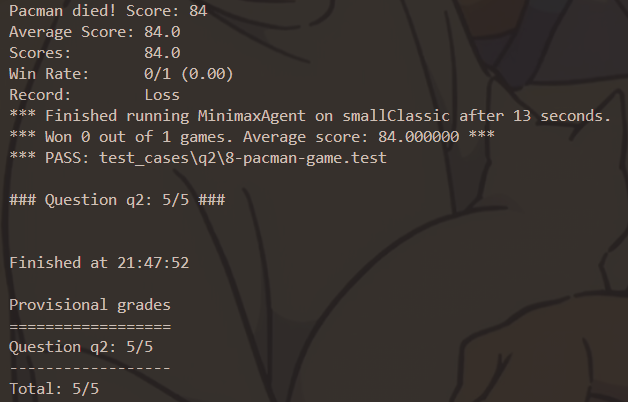游戏的结束截图: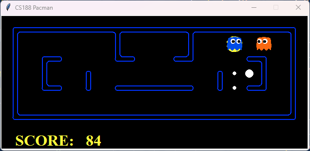**分析:pacman虽然没有获胜,但是通过了所有的测试用例,实验成功.**

## 任务二:实现α-β剪枝算法

1. **实现思路**:本质上,任务二是在任务一的基础上进行剪枝.剪枝原理如下:初始的α值为-∞,表示当前场上的最大可能得分;初始的β值为+∞,表示当前场上的最小可能得分;==在吃豆人代理进行结果遍历时==,不断获取场上的当前最高分数作为alpha值传入下一小层递归;在幽灵代理进行结果遍历时,不断获取场上最小得分更新β值,一旦发现当前的结果`min_value`小于`alpha`,就进行剪枝,返回`mmin_value`.这是因为**幽灵代理默认吃豆人会进行最佳选择(吃豆人知道选择这个行为会使得比起选择别的行为获得更低的分数),也就没有必要对吃豆人选择的这个行为进行其他分支的检索了**,反之亦然.

2. **代码总览**

   以下是 `AlphaBetaAgent` 类的代码实现：

   ```python
   class AlphaBetaAgent(MultiAgentSearchAgent):
    

    def getAction(self, gameState: GameState):
        
        def helper(depth,game_state,agent_index,beta,alpha):
            agent_index=agent_index%game_state.getNumAgents()

            if game_state.isWin() or game_state.isLose() or depth==self.depth*gameState.getNumAgents()-1:
                return self.evaluationFunction(game_state)
            
            elif agent_index==0:
                max_value=-float('inf')
                for i in game_state.getLegalActions(agent_index):  
                    value=helper(depth+1,game_state.generateSuccessor(agent_index,i),agent_index+1,beta,alpha)
                    max_value=max(max_value,value)
                    if max_value>beta:return max_value
                    alpha=max(alpha,max_value)
                return max_value
            else:
                min_value=float('inf')
                for i in game_state.getLegalActions(agent_index):
                    value=helper(depth+1,game_state.generateSuccessor(agent_index,i),agent_index+1,beta,alpha)
                    min_value=min(value,min_value)
                    if min_value<alpha:return min_value
                    beta= min(min_value,beta)
                return min_value
        
        max_score = -float('inf')
        best_action = None
        actions = gameState.getLegalActions(0)
        beta=float('inf')
        alpha=-float('inf')
        for action in actions:
            score = helper(0, gameState.generateSuccessor(0, action), 1,beta,alpha)
            if score > max_score:
                max_score = score
                best_action = action
            alpha=max(max_score,alpha)

        return best_action
        util.raiseNotDefined()

3. **代码解释:**

    - `helper(depth, game_state, agent_index,beta,alpha)`:`alpha`:初始值为-∞.表示幽灵代理能够接受的最小值,如果遍历的分数低于这个值,表明吃豆人代理不会选择这条分路对应的行动.`beta`:初始值为+∞.表示吃豆人代理能够接受的最大值如果再次获得的max_value比这个值大,说明幽灵代理不可能接受吃豆人选择这条能够获得`beta`分数的分路.

    - **非结束条件代码段:**

        在任务1的基础上添加了剪枝判断:

        ```python
        elif agent_index==0:
                max_value=-float('inf')
                for i in game_state.getLegalActions(agent_index):  
                    value=helper(depth+1,game_state.generateSuccessor(agent_index,i),agent_index+1,beta,alpha)
                    max_value=max(max_value,value)
                    if max_value>beta:return max_value
                    alpha=max(alpha,max_value)
                return max_value
            else:
                min_value=float('inf')
                for i in game_state.getLegalActions(agent_index):
                    value=helper(depth+1,game_state.generateSuccessor(agent_index,i),agent_index+1,beta,alpha)
                    min_value=min(value,min_value)
                    if min_value<alpha:return min_value
                    beta= min(min_value,beta)
                return min_value

    - **进入helper/前置结束代码段:**

        初始化了`alpha`和`beta`,第一次for循环不需要剪枝,目的是求出所有存在分路(相对于第一次遍历)的分数,避免偶然误差.

        ```python
        max_score = -float('inf')
        best_action = None
        actions = gameState.getLegalActions(0)
        beta=float('inf')
        alpha=-float('inf')
        for action in actions:
            score = helper(0, gameState.generateSuccessor(0, action), 1,beta,alpha)
            if score > max_score:
                max_score = score
                best_action = action
            alpha=max(max_score,alpha)

        return best_action
        util.raiseNotDefined()

4. **实验结果:**  

    运行`python autograder.py -q q3`后的结果图:
    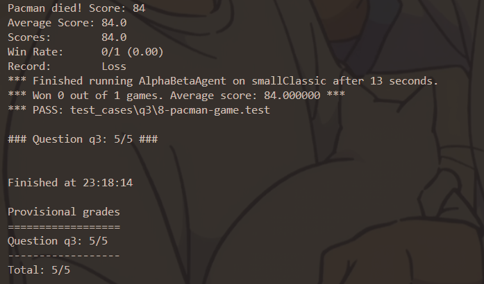游戏的结束截图:**分析:pacman虽然没有获胜,但是通过了所有的测试用例,实验成功.**
    此外,还进行了剪枝效率测试,相比不添加剪枝的minimax算法效率确实有所提升.以下是效率检测结果图: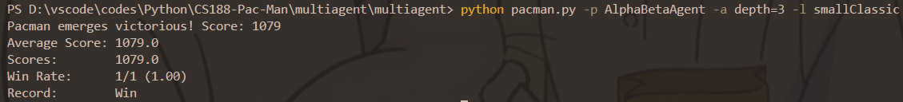检测结束的截图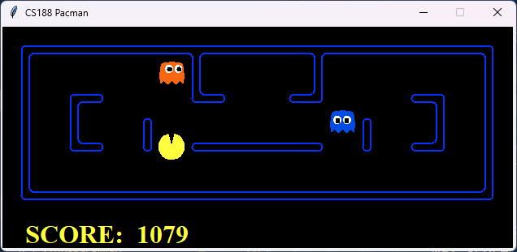

## 任务三:实现期望最大值算法

1. **实现思路**:对于所有潜在的幽灵代理,其行为不一定是最优选择,那么对于幽灵代理的返回分数,只需要在遍历所有结果之后返回其平均分,也就是"期望值"分数,就能让吃豆人代理获得最合理的应对所有幽灵代理的分数;在初始进入helper函数时再对所有结果取最大值,就能获得"期望最大值"分数了.

2. **代码总览**

   以下是 `ExpectimaxAgent` 类的代码实现：

   ```python
   class ExpectimaxAgent(MultiAgentSearchAgent):

    def getAction(self, gameState: GameState):
        def helper(depth,game_state,agent_index):
            agent_index=agent_index%game_state.getNumAgents()

            if game_state.isWin() or game_state.isLose() or depth==self.depth*gameState.getNumAgents()-1:
                return self.evaluationFunction(game_state)
            
            elif agent_index==0:
                max_value=-float('inf')
                for i in game_state.getLegalActions(agent_index):  
                    value=helper(depth+1,game_state.generateSuccessor(agent_index,i),agent_index+1)
                    max_value=max(max_value,value)
                return max_value
            else:
                sum_score=0
                num=0
                for i in game_state.getLegalActions(agent_index):
                    sum_score+=helper(depth+1,game_state.generateSuccessor(agent_index,i),agent_index+1)
                    num+=1
                return sum_score/num
        
        max_score = -float('inf')
        best_action = None
        actions = gameState.getLegalActions(0)

        for action in actions:
            score = helper(0, gameState.generateSuccessor(0, action), 1)
            if score > max_score:
                max_score = score
                best_action = action

        return best_action
        util.raiseNotDefined()
3. **代码解释:**

    - **非结束条件代码段:**

        在任务1的基础上修改了幽灵代理的逻辑:
        `sum_score`:各种行动返回的总得分
        `num`:行动的数量
        返回值是平均得分.

        ```python
        else:
                sum_score=0
                num=0
                for i in game_state.getLegalActions(agent_index):
                    sum_score+=helper(depth+1,game_state.generateSuccessor(agent_index,i),agent_index+1)
                    num+=1
                return sum_score/num

4. **实验结果:**  

    运行`python autograder.py -q q4`后的结果图:
    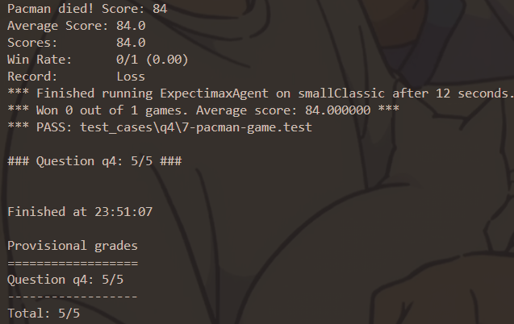游戏的结束截图: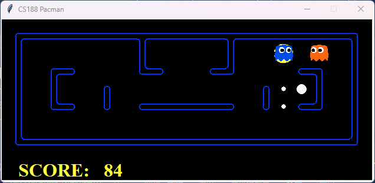**分析:pacman虽然没有获胜,但是通过了所有的测试用例,实验成功.**
    此外,还观察了最大期望搜索和α-β剪枝在随机幽灵代理的情况下的胜率分析:
    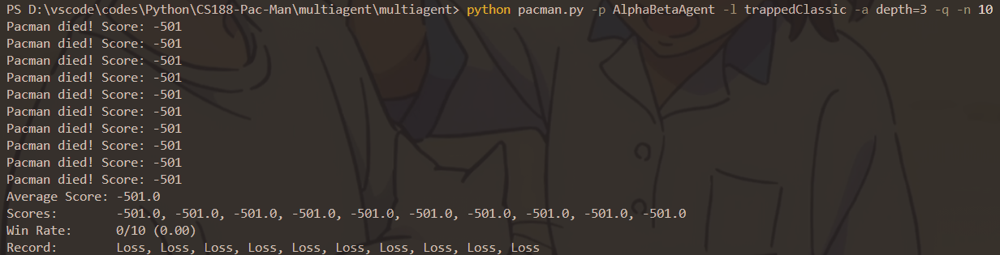α-β算法的胜率为0;
    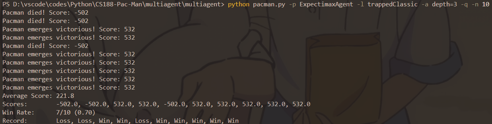期望最大值的胜率突破了百分之50.

## 任务四:实现评估函数

1. **实验思路:** 评估函数应该尽可能考虑更多的影响最终评分的因素,如场上存在食物的多少,和幽灵的距离,和食物的距离,能量球的多少和与能量球的距离,还有墙壁因素(没有被添加到最终的代码.),还有幽灵代理的剩余恐惧时间.

2. **代码总览**

   以下是 `ExpectimaxAgent` 类的代码实现：

   ```python
   def betterEvaluationFunction(currentGameState: GameState):
    Position = currentGameState.getPacmanPosition()
    GhostStates = currentGameState.getGhostStates()
    ScaredTimes = [ghostState.scaredTimer for ghostState in GhostStates]
    
    score = currentGameState.getScore()
    #walls = currentGameState.getWalls()
    Food = currentGameState.getFood()
    foodList = Food.asList()
    capsules = currentGameState.getCapsules()

    for food in foodList:
        distance = util.manhattanDistance(Position, food)
        score += 6 * math.exp(-distance / 2) + 0.7

    for capsule in capsules:
        distance = util.manhattanDistance(Position, capsule)
        score += 6 * math.exp(-distance / 2) + 0.7
    for i, ghostState in enumerate(GhostStates):
        ghostPos = ghostState.getPosition()
        distance = util.manhattanDistance(Position, ghostPos)
        if ScaredTimes[i] > 5:
            score += 150 + math.exp(3 / distance) 
        elif 0 < ScaredTimes[i] <= 5:
            score += 5 + math.exp(3 / distance)
        else:
            if distance <= 2.7:
                score -= 500 
            else:
                score -= 7 * math.exp(-distance / 2) 

    return score
    util.raiseNotDefined()
3. **代码解释:**

    - `Position`和`GhostStates`:吃豆人和幽灵在地图上的位置.
    - `ScaredTimes`:返回一个场上所有幽灵受惊吓的时间列表.
    - `score`:吃豆人的评估分数.对于当前的行为,评估分数越高,吃豆人越可能采取这一行为.
    - `Food`和`foodList`:返回场上的食物列表.
    - `capsules`返回场上的胶囊列表.
    - **食物评估得分:**

        ```python
        for food in foodList:
        distance = util.manhattanDistance(Position, food)
        score += 6 * math.exp(-distance / 2) + 0.7
    - **胶囊评估得分:**

        ```python
        for capsule in capsules:
        distance = util.manhattanDistance(Position, capsule)
        score += 6 * math.exp(-distance / 2) + 0.7
    - **幽灵评估得分:**

        对每一个幽灵采取曼哈顿距离的判断,越近越危险,当达到阈值2.7之后,瞬间降低评估得分,以让吃豆人逃脱险境;反之,若幽灵处于惊吓阶段,则距离越近得分越高,对于即将结束恐惧的幽灵,提升的分值将偏低,以避免吃豆人在前往恐惧幽灵的路上出现幽灵结束恐惧的情况.

        ```python
        for i, ghostState in enumerate(GhostStates):
        ghostPos = ghostState.getPosition()
        distance = util.manhattanDistance(Position, ghostPos)
        if ScaredTimes[i] > 5:
            score += 150 + math.exp(3 / distance) 
        elif 0 < ScaredTimes[i] <= 5:
            score += 5 + math.exp(3 / distance)
        else:
            if distance <= 2.7:
                score -= 500 
            else:
                score -= 7 * math.exp(-distance / 2)

    - **为什么采取指数函数而不采取简单的一次函数和倒数:**  采取一般的一次函数和倒数来分析距离会对远端的事件分析不敏感,采取指数函数,可以更平滑过渡到远端的事件.实际测试下,采取普通的倒数和一次函数,有一定的机率发生"待机"现象,从而导致白白流失分数.

    - **指数函数内部参数的选取:**  `math.exp(3 / distance)`采取3而不是别的数:在有限的测试次数内,选取"3"使得评估分数已经能够达到正确识别恐吓幽灵的级别,不会出现摇摆不定的情况(实测选取2的时候,甚至会输掉游戏)

    - **为什么胶囊的评分和普通食物评分一样:**同样避免"摇摆不定"的情况,提高吃豆人代理稳定性.

4. **实验结果:**  

    运行`python autograder.py -q q5`后的结果图:
    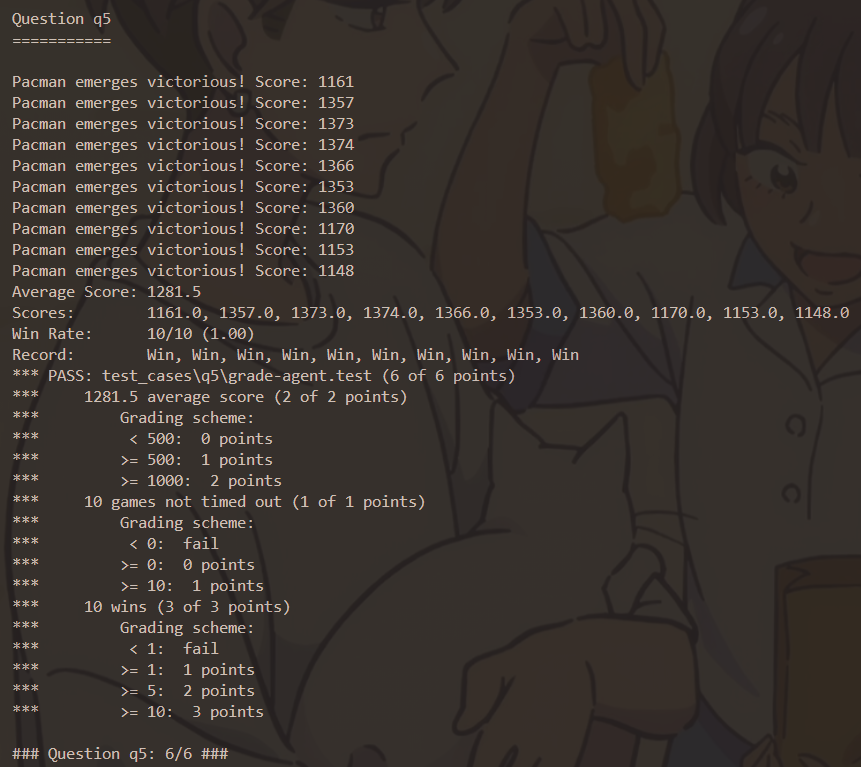游戏的结束截图: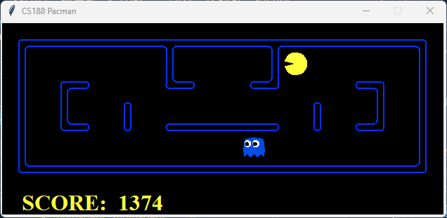
    **基本上远超1000分的要求了,并且得分非常稳定**

## 结束语

本次实验通过吃豆人这个载体,研究了搜索对抗算法中minimax算法,α-β剪枝算法等的应用,以及评估函数的合理编写,对我们在今后的学习中对更高层次的ai构建有着基础性的帮助.