# 项目3--捉鬼敢死队（Ghostbusters）

***项目人员(单人完成):李玄同 231880224 [2321599317@qq.com](2321599317@qq.com)*** 

## 摘要

本项目基于吃豆人游戏，通过实现概率推理，设计智能体使用声纳传感器定位和抓捕隐形的幽灵。幽灵的位置由贝叶斯网络表示，游戏的任务包括处理概率分布、观测更新以及路径规划，最终实现追踪并抓捕幽灵。

## 项目任务

设计和实现吃豆人智能体在各种情况下的捕获行为，包括静止幽灵和移动幽灵的追踪。通过曼哈顿距离传感器的噪声读数，估计幽灵的潜在位置，并基于这些信息优化捕捉路径。

### 任务一: 构建贝叶斯网络

1. **实现思路**

   - 使用 `constructBayesNet` 函数构建贝叶斯网络，包含节点（变量）、边以及每个变量的值域。
   - 添加幽灵和吃豆人的位置节点，以及基于曼哈顿距离的观测节点，形成如下网络结构：
        - 幽灵和吃豆人的位置影响观测节点。
   - 实现关键在于,要包含每一个可能观测到的位置(附带噪声影响),同时要去重.

2. **代码总览**

   以下是 ***Problem 1*** 的代码实现：

   ```python
   def constructBayesNet(gameState: hunters.GameState):
    
    PAC = "Pacman"
    GHOST0 = "Ghost0"
    GHOST1 = "Ghost1"
    OBS0 = "Observation0"
    OBS1 = "Observation1"
    X_RANGE = gameState.getWalls().width
    Y_RANGE = gameState.getWalls().height
    MAX_NOISE = 7

    variables = []
    edges = []
    variableDomainsDict = {}
    variables.append(PAC)
    variables.append(GHOST0)
    variables.append(GHOST1)
    variables.append(OBS0)
    variables.append(OBS1)
    edges.append((GHOST0,OBS0))
    edges.append((PAC,OBS0))
    edges.append((PAC,OBS1))
    edges.append((GHOST1,OBS1))
    pos_tuples=[(x,y)for x in range(X_RANGE) for y in range(Y_RANGE)]

    variableDomainsDict.setdefault(PAC,pos_tuples)
    variableDomainsDict.setdefault(GHOST0,pos_tuples)
    variableDomainsDict.setdefault(GHOST1,pos_tuples)
    def manhattan_distance(pos1, pos2):#曼哈顿距离
        return abs(pos1[0] - pos2[0]) + abs(pos1[1] - pos2[1])

    obs0_domain = []
    obs1_domain = []
    for pac_pos in pos_tuples:
        for ghost0_pos in pos_tuples:
            true_distance = manhattan_distance(pac_pos, ghost0_pos)
            for noise in range(-MAX_NOISE, MAX_NOISE + 1):
                obs_value = true_distance + noise#曼哈顿距离＋噪声值
                if obs_value >= 0:
                    obs0_domain.append(obs_value)#取正值

        for ghost1_pos in pos_tuples:
            true_distance = manhattan_distance(pac_pos, ghost1_pos)
            for noise in range(-MAX_NOISE, MAX_NOISE + 1):
                obs_value = true_distance + noise
                if obs_value >= 0:
                    obs1_domain.append(obs_value)

    variableDomainsDict.setdefault(OBS0, list(set(obs0_domain)))#去重
    variableDomainsDict.setdefault(OBS1, list(set(obs1_domain)))
    net = bn.constructEmptyBayesNet(variables, edges, variableDomainsDict)
    return net

### 任务二: 连接因子

1. 实现思路:

    - 使用 `joinFactors` 函数将多个因子合并。合并后的无条件变量为所有输入因子的无条件变量之并集，有条件变量为并集减去无条件变量。
    - 具体的代码解释参考代码实现中的注释
2. 代码实现:

    ```python
        def joinFactors(factors: List[Factor]):
    
    setsOfUnconditioned = [set(factor.unconditionedVariables()) for factor in factors]
    if len(factors) > 1:
        intersect = functools.reduce(lambda x, y: x & y, setsOfUnconditioned)
        if len(intersect) > 0:
            print("Factor failed joinFactors typecheck: ", factor)
            raise ValueError("unconditionedVariables can only appear in one factor. \n"
                    + "unconditionedVariables: " + str(intersect) + 
                    "\nappear in more than one input factor.\n" + 
                    "Input factors: \n" +
                    "\n".join(map(str, factors)))

    
    #Factor.getAllPossibleAssignmentDicts:获取一个因子所有可能的变量赋值组合
    #Factor.getProbability:获取指定赋值组合的概率
    #Factor.setProbability为指定的赋值组合设置一个新的概率
    #Factor.unconditionedVariables返回因子的无条件变量集合
    #Factor.conditionedVariables返回因子的有条件变量集合
    #Factor.variableDomainsDict返回因子的变量域字典，描述每个变量可能的取值。
    #步骤:确定无条件变量和条件变量->合并->确定变量域->计算联合概率(相乘即可)
    setsOfConditioned=[set(factor.conditionedVariables())for factor in factors]
    Unconditioned_var=set().union(*setsOfUnconditioned)
    Conditioned_var=set().union(*setsOfConditioned)
    Conditioned_var -= Unconditioned_var#集合操作
    domains={}
    for x in factors:
        domains.update(x.variableDomainsDict())
    #每一个变量可能的取值(重复怎么办?应该不用担心,因为更新的时候会自动屏蔽掉重复的变量)
    #构建一个新的factor
    new_factor=Factor(Unconditioned_var,Conditioned_var,domains)
    all_possible_assignments=new_factor.getAllPossibleAssignmentDicts()
    for i in all_possible_assignments:#对于每一个可能的变量赋值组合
        jp=1.0#设置联合概率值(对于当前组合的联合概率)
        for j in factors:
            factor_vars = set(j.unconditionedVariables()) | set(j.conditionedVariables())
    #所有变量合并,存在就加进来
            filters={k:v for k,v in i.items() if k in factor_vars}#i.item()返回所有键值对
            jp*=j.getProbability(filters)#联合概率=每个因子在当前组合下的概率

        new_factor.setProbability(i,jp)
    return new_factor

### 任务三: 消元操作

1. 这题的思路,一言以避之,就是把某个变量消除后,保持剩下的变量在给定的赋值组合下的联合概率仍然是之前对于这个赋值组合,求和所有已经被删除的变量的所有概率值.具体的实现思路参考代码实现

2. 代码实现:

    ```python
        def eliminate(factor: Factor, eliminationVariable: str):
        # autograder tracking -- don't remove
        if not (callTrackingList is None):
            callTrackingList.append(('eliminate', eliminationVariable))

        # typecheck portion
        if eliminationVariable not in factor.unconditionedVariables():
            print("Factor failed eliminate typecheck: ", factor)
            raise ValueError("Elimination variable is not an unconditioned variable " \
                            + "in this factor\n" + 
                            "eliminationVariable: " + str(eliminationVariable) + \
                            "\nunconditionedVariables:" + str(factor.unconditionedVariables()))
        
        if len(factor.unconditionedVariables()) == 1:
            print("Factor failed eliminate typecheck: ", factor)
            raise ValueError("Factor has only one unconditioned variable, so you " \
                    + "can't eliminate \nthat variable.\n" + \
                    "eliminationVariable:" + str(eliminationVariable) + "\n" +\
                    "unconditionedVariables: " + str(factor.unconditionedVariables()))
        setsOfUnconditioned = [set(factor.unconditionedVariables())]
        setsOfConditioned=[set(factor.conditionedVariables())]
        Unconditioned_var=set().union(*setsOfUnconditioned)
        Conditioned_var=set().union(*setsOfConditioned)
        setsOfremoved = [set([eliminationVariable])]
        removed_var=set().union(*setsOfremoved)
        Conditioned_var -= removed_var#集合操作
        Unconditioned_var -= removed_var
        domains={}
        domains2={}
        domains.update(factor.variableDomainsDict())
        domains2.update(factor.variableDomainsDict())
        del domains[eliminationVariable] #已经得到了新的newfactor,现在要让它的概率值符合删除后的值
        new_factor=Factor(Unconditioned_var,Conditioned_var,domains)
        all_possible_assignments=new_factor.getAllPossibleAssignmentDicts()
        for i in all_possible_assignments:#对于每一个可能的变量赋值组合
            jp=0.0#设置联合概率值(对于当前组合的联合概率)
            #这和第二题相乘的逻辑不一样,应要对于eliminationvariable的每一个取值,
            #去计算当前这个赋值组合的概率情况并将其相加
            factor_vars = set(new_factor.unconditionedVariables())
             | set(new_factor.conditionedVariables())#所有变量合并,存在就加进来
            filters={k:v for k,v in i.items()if k in factor_vars}#i.item()返回所有键值对
            print('error')
            for value in domains2[eliminationVariable]:
                fake_filters=filters.copy()
                fake_filters[eliminationVariable]=value
                jp+=factor.getProbability(fake_filters)
            #联合概率=每个因子在当前组合下的概率
            

            new_factor.setProbability(i,jp)
        return new_factor
    ```

### 任务四: 变量消元

1. 实现思路:

    -获取所有条件概率表,根据字典进行条件化
    -对于每一个条件变量,按照顺序执行:消除变量,将一个因子中某个变量求和,得到新的因子->在某个变量上合并因子.
    -进行归一化

2. 代码实现;

    ```python
        def inferenceByVariableElimination(bayesNet: bn,
         queryVariables: List[str], evidenceDict: Dict, eliminationOrder: List[str]):
        # this is for autograding -- don't modify
        joinFactorsByVariable = joinFactorsByVariableWithCallTracking(callTrackingList)
        eliminate             = eliminateWithCallTracking(callTrackingList)
        if eliminationOrder is None: # set an arbitrary elimination order if None given
            eliminationVariables = bayesNet.variablesSet() - set(queryVariables) -\
                                   set(evidenceDict.keys())
            eliminationOrder = sorted(list(eliminationVariables))
        
        allCPTs = bayesNet.getAllCPTsWithEvidence(evidenceDict)#allCPTs是一个包含了众多factor的list
        for var in eliminationOrder:
            if var not in queryVariables:
                factorsWithVar = [factor for factor in allCPTs]
                notjoin,joined=joinFactorsByVariable(factorsWithVar,var)#notjoin是没有包含
                if(len(joined.unconditionedVariables())==1):
                    allCPTs=notjoin
                else:
                    eli=eliminate(joined,var)#这里如果只有一个变量传进去会直接报错?
                    allCPTs=[eli]+notjoin
        final=joinFactors(allCPTs)
        nor_final=normalize(final)
        return nor_final
    ```

### 任务五: 实现discredistributiuon类&实现getobservationprob方法

1. 实现思路:

    - 对于normalize方法,只需要遍历所有非零分布值,对每一个值除以total值即可
    - 对于sample方法,使用`random.choices`按比例进行采样即可
    - 对于`getobservationprob`方法,只需要搞清楚什么时候应该"置零":如果吃豆人此时的位置处于监狱的位置并且噪声距离不为`none`,或者吃豆人不在监狱中并且噪声距离为`none`,那么置信度就应该为0;如果在监狱中并且噪声距离为`none`,那么置信度为1(一定确定在监狱中).对于其他的情况,先通过`manhattanDistance`返回一个确定的距离,再通过`busters.getObservationProbability(noisyDistance, trueDistance)`获得分布.
2. 代码实现:

    ```python
    def normalize(self):
        all=self.total()
        if all!=0 and len(self)!=0:
            for i in self :
                self[i]=self[i]/all

    def sample(self):
        keys=list(self.keys())
        weights=list(self.values())
        sampleKey=random.choices(keys,weights,k=1)[0]
        return sampleKey
    
    def getObservationProb(self, noisyDistance: int, pacmanPosition: Tuple, 
    ghostPosition: Tuple, jailPosition: Tuple):
        if ghostPosition==jailPosition:
            if noisyDistance is None:
                return 1.0
            else: 
                return 0.0
        if noisyDistance is None:
            return 0.0
        trueDistance=manhattanDistance(pacmanPosition,ghostPosition)
        return busters.getObservationProbability(noisyDistance,trueDistance)
    ```

### 任务六: 精确推理:观测

1. 实现思路:

    - 获取pacman和监狱位置;
    - 初始化信念分布(使用`DiscreteDistribution()`)
    - 对于每一个可能的位置,更新后验概率
    - 思想:`X`:幽灵的位置; `O`:观测动作; P(X|O)(在观测后,幽灵位于X的概率)=P(O|X)(若幽灵位于X,这个位置观测时被鉴定为有幽灵的概率,使用`getObservationProb`函数)*P(X)(先验概率)

2. 代码实现:

    ```python
        def observeUpdate(self, observation: int, gameState: busters.GameState):

        pac_pos=gameState.getPacmanPosition()
        jail_pos=self.getJailPosition()
        new_beliefs=DiscreteDistribution()

        for position in self.allPositions:
            observation_prob=self.getObservationProb(observation,pac_pos,position,jail_pos) 
            #每一个地方的置信度
            prior_prob=self.beliefs[position] #先验概率
            new_beliefs[position]=prior_prob*observation_prob #两者相乘

        self.beliefs=new_beliefs
        self.beliefs.normalize() #别忘了更新和归一化
    ```

### 任务七: 精确推理: 时间推移

1. 实现思路:

    - 代码结构和任务六的非常像,但在实现细节上,可以用`P(Xt+1)=∑P(Xt+1|Xt)*P(Xt)`来表示
    - 对于每一个旧位置,使用`getPositionDistribution`获取可能的新位置还有对应概率的字典`newPosDist`,在新位置上更新(累和)所有可能的置信度.

2. 代码实现:

    ```python
        def elapseTime(self, gameState: busters.GameState):

        new_beliefs=DiscreteDistribution()

        for oldPos in self.allPositions:
            newPosDist = self.getPositionDistribution(gameState, oldPos)
            for new_pos,prob in newPosDist.items():
                new_beliefs[new_pos]+=self.beliefs[oldPos]*prob 
                #累和更新,不用担心对于当前位置累和不完全,遍历完之后的累和是绝对完整的

        self.beliefs=new_beliefs
        self.beliefs.normalize() #记得归一化
    ```

### 任务八: 精确推理: 完整测试

1. 实现思路:
   - 获取当前 Pacman 位置、合法动作、活着幽灵及其信念分布。
   - 计算每个活着幽灵的最可能位置。
   - 遍历所有合法动作：
      - 预测该动作后的 Pacman 位置。
      - 计算该位置到所有幽灵最可能位置的最短距离。
      - 记录使距离最短的动作。
   - 返回最佳动作。


2. 代码实现:

    ```python
        def chooseAction(self, gameState: busters.GameState):
        pacmanPosition = gameState.getPacmanPosition()#吃豆人当前位置
        legal = [a for a in gameState.getLegalPacmanActions()] #pacman可以执行的合法动作
        livingGhosts = gameState.getLivingGhosts()#活着的鬼魂列表
        livingGhostPositionDistributions = \
            [beliefs for i, beliefs in enumerate(self.ghostBeliefs)
             if livingGhosts[i+1]]#活着的鬼魂信念分布
        most_likely_pos=[]
        for i in livingGhostPositionDistributions:
            pos=max(i, key=i.get)
            most_likely_pos.append(pos)
        best_action = None
        min_distance=float('inf')#设置成最大值以便于之后更新

        for action in legal:
            successor_position = Actions.getSuccessor(pacmanPosition, action)
            closest_ghost=
            min(self.distancer.getDistance(successor_position,ghost_pos)
            for ghost_pos in most_likely_pos)
            #这是对于当前行动最短的路径
            if closest_ghost < min_distance:
                min_distance = closest_ghost
                best_action = action
        return best_action
        #步骤:计算每一个鬼魂最可能的位置->计算每个可行动作的迷宫距离()选最短的那一个
    ```

### 任务九: 近似推理:初始化与置信度

1. 实现思路:
    - 对于`initializeUniformly`:保证粒子被均匀化分布在合法位置上即可
    - 对于`getBeliefDistribution`:统计所有particle所在的位置出现的概率,归一化即可

2. 代码实现:

    ```python
        def initializeUniformly(self, gameState: busters.GameState):

        self.particles = []
        self.particles=
        [self.legalPositions[i%len(self.legalPositions)]for i in range(self.numParticles)]
 

    def getBeliefDistribution(self):

        belief = DiscreteDistribution()
        for particle in self.particles:
            belief[particle]+=1.0
        belief.normalize()
        return belief
    ```

### 任务十: 近似推理:观测

1. 实现思路:
    - 获取当前的吃豆人位置,幽灵监狱位置和当前信念分布;
    - 基于当前信念分布,对于每一个可能的幽灵存在的合法位置,获取对于这个位置观测的置信度.(当前位置可能有幽灵的可能性)
    - 如果所有的置信度综合为0,说明观测值和信念分布不一致(在`getObservationProb`出现返回值为0的现象,意味着传入的`observation`是none或者观测到的概率就是0),因此要重新初始化粒子分布并返回函数.
    - 之后就是归一化信念分布并根据新的分布重新生成新的粒子.

2. 代码实现:

    ```python
        def observeUpdate(self, observation: int, gameState: busters.GameState):

        pac_pos=gameState.getPacmanPosition()
        jail_pos=self.getJailPosition()
        weight_distribution = self.getBeliefDistribution()
        for ghost_pos in self.allPositions:
            weight_distribution[ghost_pos] *= self.getObservationProb(observation, pac_pos,
                                           ghost_pos, jail_pos)
        if weight_distribution.total() == 0:
            self.initializeUniformly(gameState)
            return
        weight_distribution.normalize()
        self.particles = [weight_distribution.sample() for _ in range(self.numParticles)]
    ```

### 任务十一

1. 实现思路:
    - 基于当前粒子分布对下一个时间步的粒子分布进行采样预测.

2. 代码实现:

    ```python
        def elapseTime(self, gameState):
        self.particles = [self.getPositionDistribution(gameState, particle).sample()
                          for particle in self.particles]
    ```

## 各个项目结果截图:

1. 运行`python autograder.py -q q1`后的结果图:  
    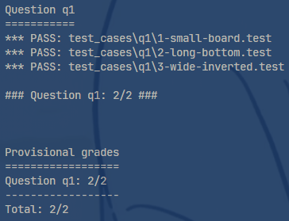

2. 运行`python autograder.py -q q2`后的结果图:  
    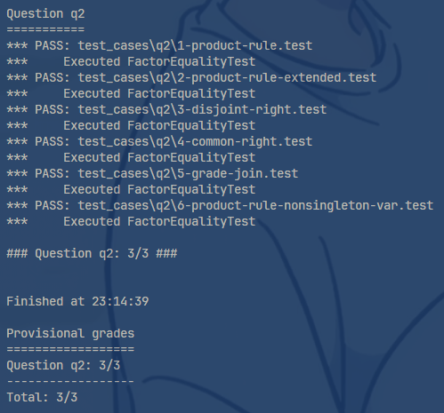

3. 运行`python autograder.py -q q3`后的结果图:  
    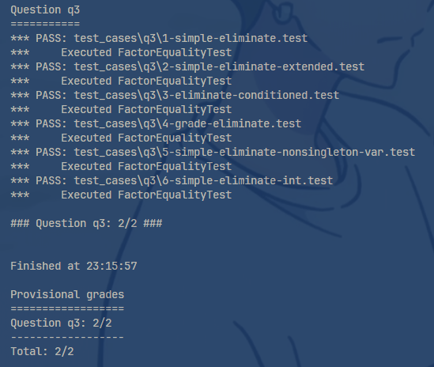

4. 运行`python autograder.py -q q4`后的结果图:  
    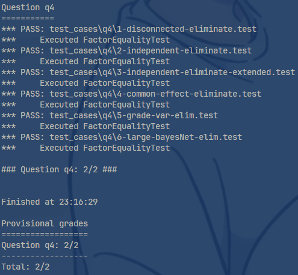

5. 运行`python autograder.py -q q5`后的结果图:  
    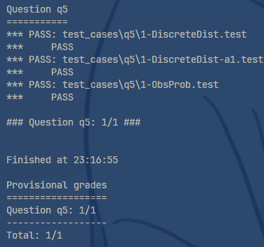

6. 运行`python autograder.py -q q6`后的结果图:  
    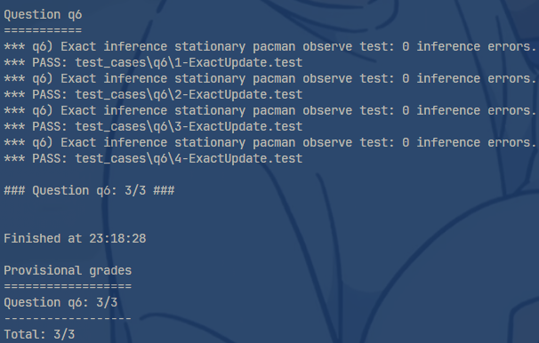

7. 运行`python autograder.py -q q7`后的结果图:  
    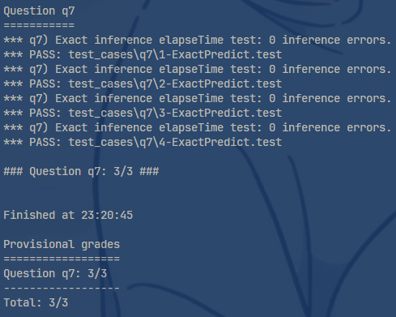

8. 运行`python autograder.py -q q8`后的结果图:  
    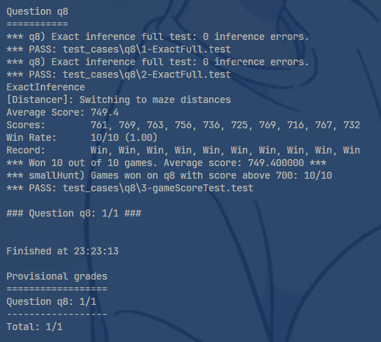

9. 运行`python autograder.py -q q9`后的结果图:  
    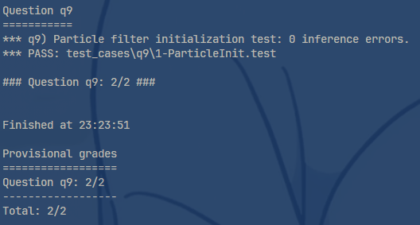

10. 运行`python autograder.py -q q10`后的结果图:  
    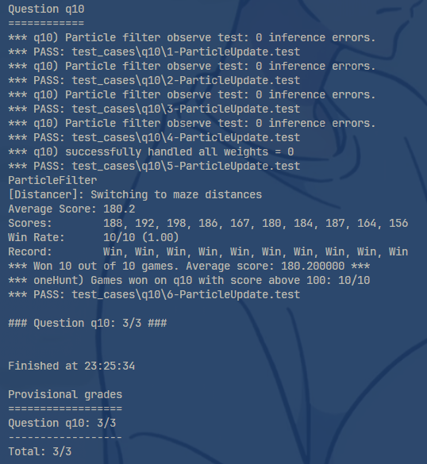

11. 运行`python autograder.py -q q11`后的结果图:  
    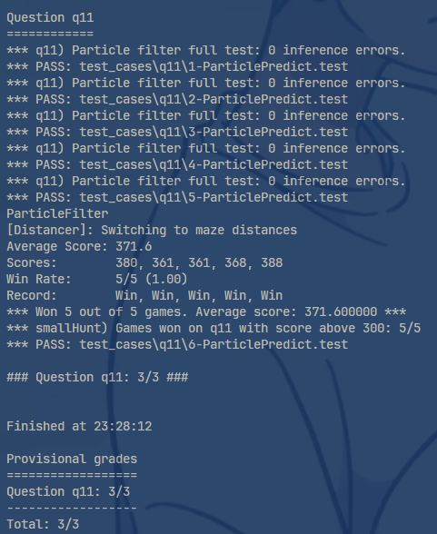

## 结语:

通过本次项目，我们深入学习了如何设计智能体，结合概率推理和动态决策来实现对隐形幽灵的定位和捕捉。项目的核心是利用贝叶斯网络和粒子滤波等方法处理不确定性，并通过动态更新信念分布来提升幽灵位置预测的准确性。

本次实验帮助我们更好地理解了概率模型在复杂系统中的应用，也培养了我们分析问题和实现算法的能力。通过理论与实践的结合，这是一段充实且富有收获的学习旅程。